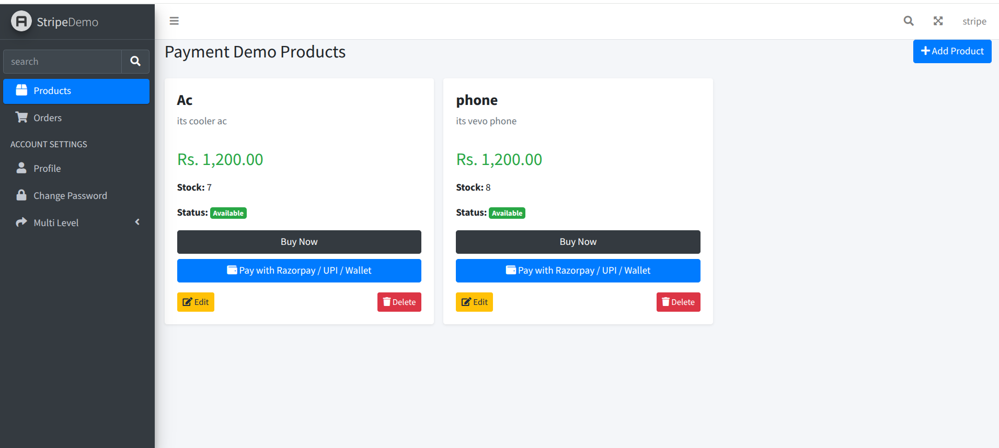
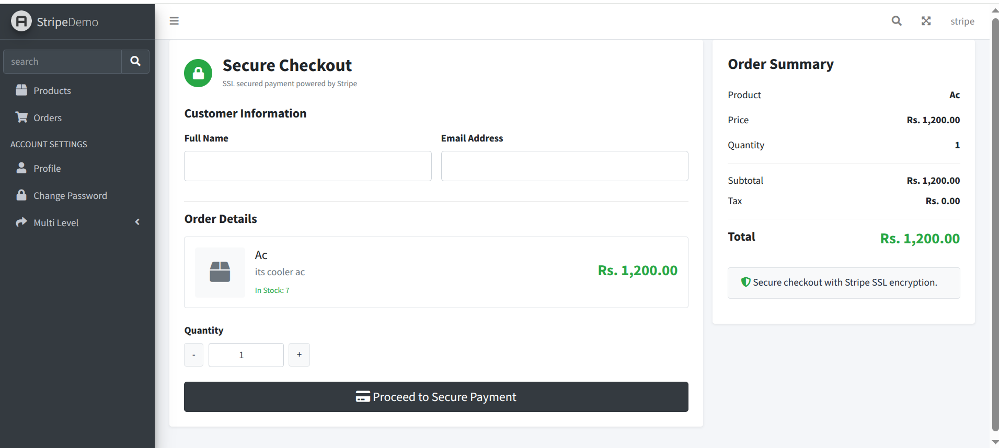
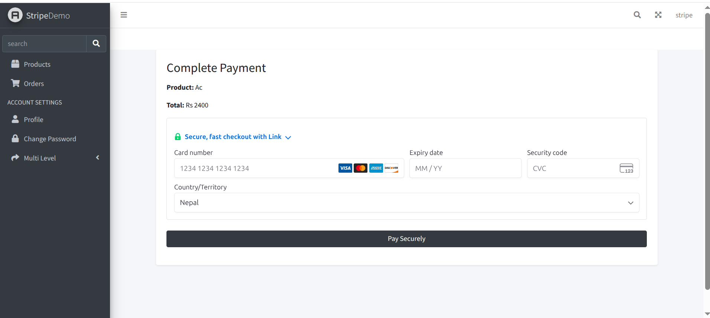
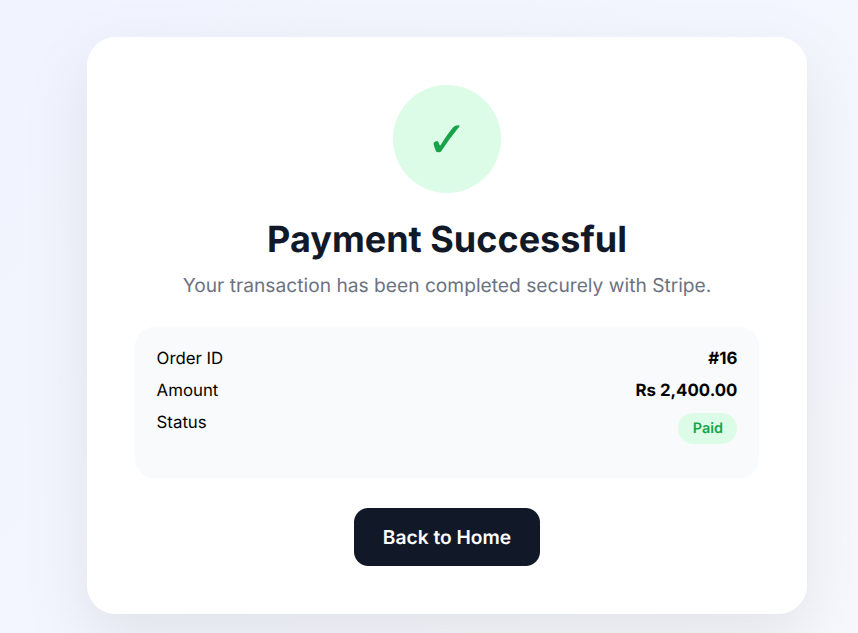
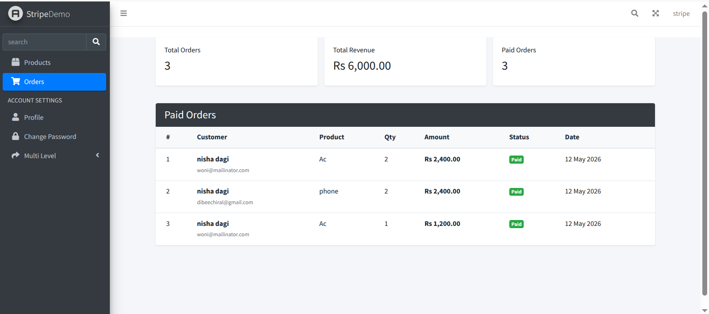

# 💳 Laravel Stripe Payment System (SaaS Demo Project)

A secure and modern payment system built with Laravel using Stripe PaymentIntent and Stripe Elements.

This project demonstrates a real-world e-commerce checkout flow with full order management system.


## 🌟 Key Features

 🔐 Secure Stripe Payment Integration (PaymentIntent)
 💳 Embedded Card Payment (No redirect checkout)
 📦 Product checkout system
 📊 Admin dashboard for orders
 📉 Automatic stock deduction after payment
 🧾 Payment status tracking (Pending / Paid)
 🎨 Clean responsive UI (AdminLTE)
 ⚡ Real-time Stripe payment confirmation


## 🔄 Payment Flow


Product Page
↓
Checkout Form (Customer Details)
↓
Stripe Card Input (Payment Element)
↓
Payment Processing by Stripe
↓
Success Page
↓
Order Stored in Database
↓
Admin Dashboard (Paid Orders View)


## 🧪 Test Card (Stripe Sandbox)

Use this test card for payments:

- **Card Number:** 4242 4242 4242 4242  
- **Expiry Date:** Any future date (e.g. 12/34)  
- **CVC:** Any 3 digits (e.g. 123)  
- **ZIP:** Any valid postal code  

⚠️ This project runs in Stripe TEST MODE only. No real money is charged.


## 📸 Screenshots

### 🛒 product Page


### 🛒 Checkout Page


### 💳 Stripe Payment Form


### ✅ Success Page


### 📊 Admin Orders Dashboard



## ⚙️ Installation

```bash
git clone https://github.com/your-username/stripe-demo.git
cd stripe-demo
composer install
npm install
cp .env.example .env
php artisan key:generate
````


## 🛠️ Setup Environment

```env
DB_DATABASE=your_database
DB_USERNAME=root
DB_PASSWORD=

STRIPE_KEY=your_stripe_publishable_key
STRIPE_SECRET=your_stripe_secret_key
```


## 🚀 Run Project

```bash
php artisan migrate
php artisan serve
```


## 🔐 Security Notes

* Stripe handles all card data (PCI compliant)
* No card details stored in database
* `.env` file is ignored using `.gitignore`
* Only payment references are stored

---

## 🧾 Database

✔ Migrations (recommended approach)


## 👨‍💻 Tech Stack

* Laravel 10+
* Stripe API (PaymentIntent)
* Blade Templates
* AdminLTE UI
* MySQL


## 📌 Author

Built by Dharma Chiral
Laravel & Stripe Freelance Developer


## 💡 Next Improvements (Optional)

If you want to upgrade this project further, you can add:

🔥 Stripe Webhooks (auto payment confirmation)  
🔥 Invoice PDF generation  
🔥 Live deployment (demo server)  
🔥 Admin revenue analytics dashboard  
🔥 Multi-product cart system  
